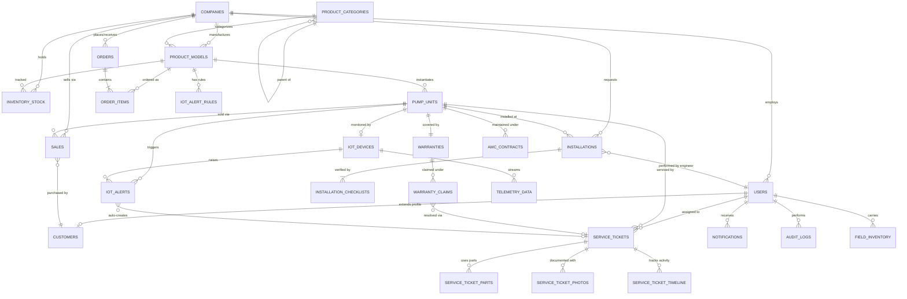

# HydraFlow Systems — Application Plan, Database Structure & ER Diagram

> [!NOTE]
> This document is derived from a thorough review of the **hyrdaFlow** Stitch project (40+ screens) — a **multi-tenant Water Pump Management Platform** serving Manufacturers, Dealers, Service Engineers, and Customers with IoT monitoring, warranty tracking, and service lifecycle management.

---

## 1. Application Overview

**HydraFlow** is an industrial-grade SaaS platform for the water pump ecosystem. It manages the entire product lifecycle from manufacturing → distribution → installation → IoT monitoring → service & repair → warranty/AMC.

### Multi-Tenant Portal Architecture

| Portal | Role | Key Capabilities |
|---|---|---|
| **Authentication** | All Users | Splash, Login, Register, Forgot Password |
| **Manufacturer Portal** | Pump OEMs | Product catalog, ecosystem overview, installations & logistics, warranty & service, IoT ops & analytics |
| **Dealer Portal** | Distributors | Dashboard & inventory, customer registration & sale, installation management, procurement & order history |
| **Service Engineer Portal** | Field Technicians | Today's dashboard, assigned jobs queue, installation workflow, repair & diagnosis, job sign-off & history, field inventory |
| **Customer Portal** | End Users | Home dashboard, my pumps & IoT health, warranty & AMC, raise service request, notifications & profile |
| **Admin Portal** | System Admins | Company & user management, product & warranty management, installation & service governance, IoT health monitoring, analytics & settings, system reports |
| **Global Ops** | Super Admin | Global operations dashboard, live pump IoT monitoring |

---

## 2. Complete Database Schema

### 2.1 Core Identity & Multi-Tenancy

#### `companies`
| Column | Type | Constraints | Description |
|---|---|---|---|
| `id` | UUID | PK | Unique company identifier |
| `name` | VARCHAR(255) | NOT NULL | Company display name |
| `type` | ENUM | NOT NULL | `MANUFACTURER`, `DEALER`, `SERVICE_PROVIDER` |
| `registration_number` | VARCHAR(100) | UNIQUE | Business registration / GST |
| `address` | JSONB | | Structured address object |
| `phone` | VARCHAR(20) | | Primary contact phone |
| `email` | VARCHAR(255) | | Primary contact email |
| `logo_url` | TEXT | | Company logo URL |
| `status` | ENUM | DEFAULT 'ACTIVE' | `ACTIVE`, `SUSPENDED`, `DEACTIVATED` |
| `subscription_plan` | ENUM | | `BASIC`, `PROFESSIONAL`, `ENTERPRISE` |
| `created_at` | TIMESTAMPTZ | DEFAULT NOW() | |
| `updated_at` | TIMESTAMPTZ | | |

#### `users`
| Column | Type | Constraints | Description |
|---|---|---|---|
| `id` | UUID | PK | |
| `company_id` | UUID | FK → companies.id, NULLABLE | NULL for customers |
| `email` | VARCHAR(255) | UNIQUE, NOT NULL | Login email |
| `password_hash` | VARCHAR(255) | NOT NULL | Bcrypt hash |
| `first_name` | VARCHAR(100) | NOT NULL | |
| `last_name` | VARCHAR(100) | NOT NULL | |
| `phone` | VARCHAR(20) | | |
| `role` | ENUM | NOT NULL | `SUPER_ADMIN`, `ADMIN`, `MANUFACTURER_USER`, `DEALER_USER`, `SERVICE_ENGINEER`, `CUSTOMER` |
| `avatar_url` | TEXT | | Profile image |
| `is_verified` | BOOLEAN | DEFAULT FALSE | Email verification |
| `is_active` | BOOLEAN | DEFAULT TRUE | Account status |
| `last_login_at` | TIMESTAMPTZ | | |
| `notification_prefs` | JSONB | | Push / email / SMS preferences |
| `created_at` | TIMESTAMPTZ | DEFAULT NOW() | |
| `updated_at` | TIMESTAMPTZ | | |

#### `roles_permissions`
| Column | Type | Constraints | Description |
|---|---|---|---|
| `id` | UUID | PK | |
| `role` | ENUM | NOT NULL | Maps to user roles |
| `permission` | VARCHAR(100) | NOT NULL | e.g. `pumps.read`, `service.create` |
| `granted` | BOOLEAN | DEFAULT TRUE | |

---

### 2.2 Product Catalog & Inventory

#### `product_categories`
| Column | Type | Constraints | Description |
|---|---|---|---|
| `id` | UUID | PK | |
| `name` | VARCHAR(255) | NOT NULL | e.g. "Submersible", "Centrifugal", "Borewell" |
| `description` | TEXT | | |
| `icon_url` | TEXT | | Category icon |
| `parent_id` | UUID | FK → self, NULLABLE | For sub-categories |

#### `product_models`
| Column | Type | Constraints | Description |
|---|---|---|---|
| `id` | UUID | PK | |
| `manufacturer_id` | UUID | FK → companies.id, NOT NULL | Manufacturer company |
| `category_id` | UUID | FK → product_categories.id | |
| `model_name` | VARCHAR(255) | NOT NULL | e.g. "AquaForce 500X" |
| `model_number` | VARCHAR(100) | UNIQUE, NOT NULL | SKU |
| `description` | TEXT | | |
| `specifications` | JSONB | | `{power_hp, voltage, phase, flow_rate_lpm, head_m, ...}` |
| `mrp` | DECIMAL(12,2) | | Maximum retail price |
| `dealer_price` | DECIMAL(12,2) | | Wholesale price |
| `warranty_months` | INTEGER | DEFAULT 12 | Standard warranty period |
| `is_iot_enabled` | BOOLEAN | DEFAULT FALSE | Has IoT sensor support |
| `images` | TEXT[] | | Array of image URLs |
| `status` | ENUM | DEFAULT 'ACTIVE' | `ACTIVE`, `DISCONTINUED`, `DRAFT` |
| `created_at` | TIMESTAMPTZ | DEFAULT NOW() | |
| `updated_at` | TIMESTAMPTZ | | |

#### `pump_units` (Individual Serialized Pumps)
| Column | Type | Constraints | Description |
|---|---|---|---|
| `id` | UUID | PK | |
| `model_id` | UUID | FK → product_models.id, NOT NULL | Which model |
| `serial_number` | VARCHAR(100) | UNIQUE, NOT NULL | Physical serial number |
| `manufacturing_date` | DATE | | |
| `batch_number` | VARCHAR(50) | | Production batch |
| `qr_code` | VARCHAR(255) | UNIQUE | For field scanning |
| `iot_device_id` | VARCHAR(255) | UNIQUE, NULLABLE | IoT gateway device ID |
| `current_owner_id` | UUID | FK → users.id, NULLABLE | Current customer owner |
| `current_dealer_id` | UUID | FK → companies.id, NULLABLE | Dealer holding stock |
| `status` | ENUM | DEFAULT 'IN_FACTORY' | `IN_FACTORY`, `IN_TRANSIT`, `AT_DEALER`, `SOLD`, `INSTALLED`, `DECOMMISSIONED` |
| `installation_id` | UUID | FK → installations.id, NULLABLE | Link to installation record |
| `location` | GEOGRAPHY(POINT) | NULLABLE | GPS coordinates when installed |
| `created_at` | TIMESTAMPTZ | DEFAULT NOW() | |
| `updated_at` | TIMESTAMPTZ | | |

#### `inventory_stock`
| Column | Type | Constraints | Description |
|---|---|---|---|
| `id` | UUID | PK | |
| `company_id` | UUID | FK → companies.id, NOT NULL | Dealer or manufacturer warehouse |
| `model_id` | UUID | FK → product_models.id, NOT NULL | |
| `quantity_on_hand` | INTEGER | DEFAULT 0 | |
| `quantity_reserved` | INTEGER | DEFAULT 0 | Allocated to orders |
| `reorder_level` | INTEGER | DEFAULT 5 | Low stock threshold |
| `warehouse_location` | VARCHAR(255) | | |
| `last_restocked_at` | TIMESTAMPTZ | | |
| `updated_at` | TIMESTAMPTZ | | |
| | | UNIQUE(company_id, model_id) | One stock record per model per company |

#### `field_inventory` (Service Engineer Parts)
| Column | Type | Constraints | Description |
|---|---|---|---|
| `id` | UUID | PK | |
| `engineer_id` | UUID | FK → users.id, NOT NULL | Service engineer user |
| `part_name` | VARCHAR(255) | NOT NULL | |
| `part_number` | VARCHAR(100) | | |
| `quantity` | INTEGER | NOT NULL | |
| `category` | ENUM | | `SPARE_PART`, `TOOL`, `CONSUMABLE` |
| `last_replenished_at` | TIMESTAMPTZ | | |

---

### 2.3 Sales & Distribution

#### `orders`
| Column | Type | Constraints | Description |
|---|---|---|---|
| `id` | UUID | PK | |
| `order_number` | VARCHAR(50) | UNIQUE, NOT NULL | Human-readable (e.g. ORD-2026-0001) |
| `dealer_id` | UUID | FK → companies.id, NOT NULL | Ordering dealer |
| `manufacturer_id` | UUID | FK → companies.id, NOT NULL | Supplying manufacturer |
| `status` | ENUM | DEFAULT 'DRAFT' | `DRAFT`, `SUBMITTED`, `CONFIRMED`, `SHIPPED`, `DELIVERED`, `CANCELLED` |
| `total_amount` | DECIMAL(14,2) | | |
| `discount_percent` | DECIMAL(5,2) | DEFAULT 0 | |
| `tax_amount` | DECIMAL(12,2) | | |
| `notes` | TEXT | | |
| `ordered_at` | TIMESTAMPTZ | | |
| `expected_delivery` | DATE | | |
| `delivered_at` | TIMESTAMPTZ | | |
| `created_at` | TIMESTAMPTZ | DEFAULT NOW() | |

#### `order_items`
| Column | Type | Constraints | Description |
|---|---|---|---|
| `id` | UUID | PK | |
| `order_id` | UUID | FK → orders.id, NOT NULL | |
| `model_id` | UUID | FK → product_models.id, NOT NULL | |
| `quantity` | INTEGER | NOT NULL | |
| `unit_price` | DECIMAL(12,2) | NOT NULL | |
| `line_total` | DECIMAL(12,2) | GENERATED | quantity × unit_price |

#### `sales` (Dealer → Customer sale)
| Column | Type | Constraints | Description |
|---|---|---|---|
| `id` | UUID | PK | |
| `sale_number` | VARCHAR(50) | UNIQUE | |
| `dealer_id` | UUID | FK → companies.id, NOT NULL | Selling dealer |
| `customer_id` | UUID | FK → users.id, NOT NULL | Buying customer |
| `pump_unit_id` | UUID | FK → pump_units.id, NOT NULL | Specific serial unit sold |
| `sale_price` | DECIMAL(12,2) | | |
| `sale_date` | DATE | NOT NULL | |
| `invoice_url` | TEXT | | PDF invoice |
| `payment_method` | ENUM | | `CASH`, `UPI`, `CARD`, `BANK_TRANSFER`, `FINANCING` |
| `created_at` | TIMESTAMPTZ | DEFAULT NOW() | |

#### `customers` (Extended customer profile)
| Column | Type | Constraints | Description |
|---|---|---|---|
| `id` | UUID | PK, FK → users.id | Links to users table |
| `address_line1` | VARCHAR(255) | | |
| `address_line2` | VARCHAR(255) | | |
| `city` | VARCHAR(100) | | |
| `state` | VARCHAR(100) | | |
| `pincode` | VARCHAR(10) | | |
| `gps_location` | GEOGRAPHY(POINT) | | For service engineer navigation |
| `preferred_contact_time` | VARCHAR(50) | | |
| `registered_by_dealer_id` | UUID | FK → companies.id | Which dealer registered them |

---

### 2.4 Installation Management

#### `installations`
| Column | Type | Constraints | Description |
|---|---|---|---|
| `id` | UUID | PK | |
| `installation_number` | VARCHAR(50) | UNIQUE | e.g. INST-2026-0042 |
| `pump_unit_id` | UUID | FK → pump_units.id, NOT NULL | |
| `customer_id` | UUID | FK → users.id, NOT NULL | |
| `dealer_id` | UUID | FK → companies.id | Requesting dealer |
| `engineer_id` | UUID | FK → users.id, NULLABLE | Assigned service engineer |
| `status` | ENUM | DEFAULT 'REQUESTED' | `REQUESTED`, `SCHEDULED`, `IN_PROGRESS`, `COMPLETED`, `VERIFIED`, `CANCELLED` |
| `scheduled_date` | DATE | | |
| `scheduled_time_slot` | VARCHAR(50) | | e.g. "09:00–12:00" |
| `installation_type` | ENUM | | `NEW`, `REPLACEMENT`, `RELOCATION` |
| `site_address` | JSONB | | Full installation address |
| `site_gps` | GEOGRAPHY(POINT) | | GPS coords |
| `borewell_depth_ft` | DECIMAL(8,2) | | |
| `water_table_depth_ft` | DECIMAL(8,2) | | |
| `power_supply_type` | ENUM | | `SINGLE_PHASE`, `THREE_PHASE`, `SOLAR` |
| `notes` | TEXT | | |
| `started_at` | TIMESTAMPTZ | | |
| `completed_at` | TIMESTAMPTZ | | |
| `created_at` | TIMESTAMPTZ | DEFAULT NOW() | |

#### `installation_checklists`
| Column | Type | Constraints | Description |
|---|---|---|---|
| `id` | UUID | PK | |
| `installation_id` | UUID | FK → installations.id, NOT NULL | |
| `step_number` | INTEGER | NOT NULL | Sequence order |
| `step_title` | VARCHAR(255) | NOT NULL | e.g. "Verify electrical connections" |
| `is_completed` | BOOLEAN | DEFAULT FALSE | |
| `completed_by` | UUID | FK → users.id, NULLABLE | |
| `completed_at` | TIMESTAMPTZ | | |
| `notes` | TEXT | | Field engineer notes |
| `photo_urls` | TEXT[] | | Evidence photos |

---

### 2.5 Warranty & AMC

#### `warranties`
| Column | Type | Constraints | Description |
|---|---|---|---|
| `id` | UUID | PK | |
| `pump_unit_id` | UUID | FK → pump_units.id, NOT NULL, UNIQUE | |
| `warranty_type` | ENUM | NOT NULL | `STANDARD`, `EXTENDED`, `PREMIUM` |
| `start_date` | DATE | NOT NULL | Typically = installation completion date |
| `end_date` | DATE | NOT NULL | |
| `status` | ENUM | DEFAULT 'ACTIVE' | `ACTIVE`, `EXPIRED`, `VOIDED`, `CLAIMED` |
| `terms_document_url` | TEXT | | |
| `registered_by` | UUID | FK → users.id | |
| `created_at` | TIMESTAMPTZ | DEFAULT NOW() | |

#### `warranty_claims`
| Column | Type | Constraints | Description |
|---|---|---|---|
| `id` | UUID | PK | |
| `claim_number` | VARCHAR(50) | UNIQUE | |
| `warranty_id` | UUID | FK → warranties.id, NOT NULL | |
| `customer_id` | UUID | FK → users.id, NOT NULL | |
| `issue_description` | TEXT | NOT NULL | |
| `claim_type` | ENUM | | `REPAIR`, `REPLACEMENT`, `REFUND` |
| `status` | ENUM | DEFAULT 'SUBMITTED' | `SUBMITTED`, `UNDER_REVIEW`, `APPROVED`, `REJECTED`, `RESOLVED` |
| `resolution_notes` | TEXT | | |
| `service_ticket_id` | UUID | FK → service_tickets.id, NULLABLE | Linked service job |
| `filed_at` | TIMESTAMPTZ | DEFAULT NOW() | |
| `resolved_at` | TIMESTAMPTZ | | |

#### `amc_contracts` (Annual Maintenance Contracts)
| Column | Type | Constraints | Description |
|---|---|---|---|
| `id` | UUID | PK | |
| `contract_number` | VARCHAR(50) | UNIQUE | |
| `customer_id` | UUID | FK → users.id, NOT NULL | |
| `pump_unit_id` | UUID | FK → pump_units.id, NOT NULL | |
| `plan_type` | ENUM | | `BASIC`, `SILVER`, `GOLD`, `PLATINUM` |
| `start_date` | DATE | NOT NULL | |
| `end_date` | DATE | NOT NULL | |
| `annual_fee` | DECIMAL(10,2) | | |
| `visits_included` | INTEGER | | Number of preventive visits per year |
| `visits_used` | INTEGER | DEFAULT 0 | |
| `status` | ENUM | DEFAULT 'ACTIVE' | `ACTIVE`, `EXPIRED`, `CANCELLED`, `RENEWED` |
| `auto_renew` | BOOLEAN | DEFAULT FALSE | |
| `created_at` | TIMESTAMPTZ | DEFAULT NOW() | |

---

### 2.6 Service & Repair

#### `service_tickets`
| Column | Type | Constraints | Description |
|---|---|---|---|
| `id` | UUID | PK | |
| `ticket_number` | VARCHAR(50) | UNIQUE, NOT NULL | e.g. SRV-2026-0108 |
| `pump_unit_id` | UUID | FK → pump_units.id, NOT NULL | |
| `customer_id` | UUID | FK → users.id, NOT NULL | |
| `assigned_engineer_id` | UUID | FK → users.id, NULLABLE | |
| `dealer_id` | UUID | FK → companies.id, NULLABLE | Originating dealer |
| `type` | ENUM | NOT NULL | `REPAIR`, `MAINTENANCE`, `INSPECTION`, `INSTALLATION`, `WARRANTY_CLAIM` |
| `priority` | ENUM | DEFAULT 'MEDIUM' | `CRITICAL`, `HIGH`, `MEDIUM`, `LOW` |
| `status` | ENUM | DEFAULT 'OPEN' | `OPEN`, `ASSIGNED`, `EN_ROUTE`, `IN_PROGRESS`, `PENDING_PARTS`, `COMPLETED`, `SIGNED_OFF`, `CANCELLED` |
| `issue_summary` | VARCHAR(500) | NOT NULL | |
| `issue_description` | TEXT | | Detailed description |
| `reported_fault_code` | VARCHAR(50) | | IoT-detected fault code |
| `diagnosis` | TEXT | | Engineer's diagnosis |
| `resolution` | TEXT | | What was done to fix |
| `scheduled_date` | DATE | | |
| `scheduled_time_slot` | VARCHAR(50) | | |
| `sla_due_at` | TIMESTAMPTZ | | SLA deadline |
| `started_at` | TIMESTAMPTZ | | |
| `completed_at` | TIMESTAMPTZ | | |
| `signed_off_at` | TIMESTAMPTZ | | Customer signature timestamp |
| `customer_signature_url` | TEXT | | Digital signature image |
| `customer_rating` | SMALLINT | CHECK 1..5 | Post-service rating |
| `customer_feedback` | TEXT | | |
| `created_at` | TIMESTAMPTZ | DEFAULT NOW() | |
| `updated_at` | TIMESTAMPTZ | | |

#### `service_ticket_parts` (Parts used in service)
| Column | Type | Constraints | Description |
|---|---|---|---|
| `id` | UUID | PK | |
| `ticket_id` | UUID | FK → service_tickets.id, NOT NULL | |
| `part_name` | VARCHAR(255) | NOT NULL | |
| `part_number` | VARCHAR(100) | | |
| `quantity` | INTEGER | NOT NULL | |
| `unit_cost` | DECIMAL(10,2) | | |
| `is_warranty_covered` | BOOLEAN | DEFAULT FALSE | |

#### `service_ticket_photos`
| Column | Type | Constraints | Description |
|---|---|---|---|
| `id` | UUID | PK | |
| `ticket_id` | UUID | FK → service_tickets.id, NOT NULL | |
| `photo_url` | TEXT | NOT NULL | |
| `caption` | VARCHAR(255) | | |
| `phase` | ENUM | | `BEFORE`, `DURING`, `AFTER` |
| `uploaded_at` | TIMESTAMPTZ | DEFAULT NOW() | |

#### `service_ticket_timeline` (Activity log)
| Column | Type | Constraints | Description |
|---|---|---|---|
| `id` | UUID | PK | |
| `ticket_id` | UUID | FK → service_tickets.id, NOT NULL | |
| `action` | VARCHAR(255) | NOT NULL | e.g. "Status changed to IN_PROGRESS" |
| `performed_by` | UUID | FK → users.id | |
| `timestamp` | TIMESTAMPTZ | DEFAULT NOW() | |
| `metadata` | JSONB | | Extra context |

---

### 2.7 IoT & Telemetry

#### `iot_devices`
| Column | Type | Constraints | Description |
|---|---|---|---|
| `id` | UUID | PK | |
| `device_id` | VARCHAR(255) | UNIQUE, NOT NULL | Hardware device ID |
| `pump_unit_id` | UUID | FK → pump_units.id, UNIQUE | Linked pump |
| `firmware_version` | VARCHAR(50) | | |
| `connectivity_type` | ENUM | | `4G`, `WIFI`, `LORA`, `SATELLITE` |
| `last_seen_at` | TIMESTAMPTZ | | Last telemetry ping |
| `status` | ENUM | DEFAULT 'ONLINE' | `ONLINE`, `OFFLINE`, `MAINTENANCE`, `FAULTY` |
| `battery_level` | DECIMAL(5,2) | | For battery-powered sensors |
| `signal_strength_dbm` | INTEGER | | |
| `registered_at` | TIMESTAMPTZ | DEFAULT NOW() | |

#### `telemetry_data` (Time-series — use TimescaleDB or similar)
| Column | Type | Constraints | Description |
|---|---|---|---|
| `id` | BIGSERIAL | PK | |
| `device_id` | UUID | FK → iot_devices.id, NOT NULL | |
| `timestamp` | TIMESTAMPTZ | NOT NULL | Measurement time |
| `temperature_c` | DECIMAL(6,2) | | Motor temperature |
| `pressure_bar` | DECIMAL(6,2) | | Outlet pressure |
| `flow_rate_lpm` | DECIMAL(8,2) | | Liters per minute |
| `voltage_v` | DECIMAL(6,2) | | Supply voltage |
| `current_a` | DECIMAL(6,2) | | Current draw |
| `power_kw` | DECIMAL(6,2) | | Power consumption |
| `rpm` | INTEGER | | Motor RPM |
| `vibration_mm_s` | DECIMAL(6,2) | | Vibration amplitude |
| `water_level_m` | DECIMAL(6,2) | | Borewell water level |
| `run_hours` | DECIMAL(10,2) | | Cumulative run hours |

> [!TIP]
> Partition `telemetry_data` by time (monthly) for query performance. Use hypertable if on TimescaleDB.

#### `iot_alerts`
| Column | Type | Constraints | Description |
|---|---|---|---|
| `id` | UUID | PK | |
| `device_id` | UUID | FK → iot_devices.id, NOT NULL | |
| `pump_unit_id` | UUID | FK → pump_units.id | |
| `alert_type` | ENUM | NOT NULL | `OVER_TEMP`, `LOW_PRESSURE`, `OVER_VOLTAGE`, `DRY_RUN`, `HIGH_VIBRATION`, `OFFLINE`, `ANOMALY` |
| `severity` | ENUM | NOT NULL | `CRITICAL`, `WARNING`, `INFO` |
| `message` | TEXT | | Human-readable description |
| `metric_name` | VARCHAR(50) | | Which metric triggered |
| `metric_value` | DECIMAL(10,2) | | Actual reading |
| `threshold_value` | DECIMAL(10,2) | | Threshold that was breached |
| `is_acknowledged` | BOOLEAN | DEFAULT FALSE | |
| `acknowledged_by` | UUID | FK → users.id, NULLABLE | |
| `auto_generated_ticket_id` | UUID | FK → service_tickets.id, NULLABLE | Auto-created service ticket |
| `triggered_at` | TIMESTAMPTZ | DEFAULT NOW() | |
| `resolved_at` | TIMESTAMPTZ | | |

#### `iot_alert_rules` (Configurable thresholds)
| Column | Type | Constraints | Description |
|---|---|---|---|
| `id` | UUID | PK | |
| `company_id` | UUID | FK → companies.id, NULLABLE | NULL = global default |
| `model_id` | UUID | FK → product_models.id, NULLABLE | Model-specific rule |
| `metric_name` | VARCHAR(50) | NOT NULL | e.g. "temperature_c" |
| `operator` | ENUM | NOT NULL | `GT`, `LT`, `GTE`, `LTE`, `EQ` |
| `threshold` | DECIMAL(10,2) | NOT NULL | |
| `severity` | ENUM | NOT NULL | |
| `auto_create_ticket` | BOOLEAN | DEFAULT FALSE | |
| `is_active` | BOOLEAN | DEFAULT TRUE | |

---

### 2.8 Notifications

#### `notifications`
| Column | Type | Constraints | Description |
|---|---|---|---|
| `id` | UUID | PK | |
| `user_id` | UUID | FK → users.id, NOT NULL | Recipient |
| `title` | VARCHAR(255) | NOT NULL | |
| `body` | TEXT | | |
| `type` | ENUM | | `SERVICE_UPDATE`, `IOT_ALERT`, `WARRANTY_EXPIRY`, `ORDER_STATUS`, `SYSTEM`, `PROMOTION` |
| `reference_type` | VARCHAR(50) | | e.g. "service_ticket", "order" |
| `reference_id` | UUID | | ID of related entity |
| `channel` | ENUM | | `IN_APP`, `PUSH`, `EMAIL`, `SMS` |
| `is_read` | BOOLEAN | DEFAULT FALSE | |
| `read_at` | TIMESTAMPTZ | | |
| `created_at` | TIMESTAMPTZ | DEFAULT NOW() | |

---

### 2.9 Reporting & Audit

#### `audit_logs`
| Column | Type | Constraints | Description |
|---|---|---|---|
| `id` | UUID | PK | |
| `user_id` | UUID | FK → users.id | Who performed the action |
| `entity_type` | VARCHAR(50) | NOT NULL | e.g. "pump_unit", "service_ticket" |
| `entity_id` | UUID | NOT NULL | |
| `action` | ENUM | NOT NULL | `CREATE`, `UPDATE`, `DELETE`, `STATUS_CHANGE` |
| `old_values` | JSONB | | Previous state |
| `new_values` | JSONB | | New state |
| `ip_address` | INET | | |
| `user_agent` | TEXT | | |
| `timestamp` | TIMESTAMPTZ | DEFAULT NOW() | |

#### `report_snapshots` (Cached analytics)
| Column | Type | Constraints | Description |
|---|---|---|---|
| `id` | UUID | PK | |
| `report_type` | VARCHAR(100) | NOT NULL | e.g. "monthly_service_summary" |
| `company_id` | UUID | FK → companies.id, NULLABLE | |
| `parameters` | JSONB | | Report filters |
| `data` | JSONB | NOT NULL | Cached report data |
| `generated_at` | TIMESTAMPTZ | DEFAULT NOW() | |
| `expires_at` | TIMESTAMPTZ | | |

---

## 3. Entity-Relationship Diagram



---

## 4. Key Relationship Details

### 4.1 Core Relationships Map

| From | To | Cardinality | FK Column | Business Rule |
|---|---|---|---|---|
| `companies` | `users` | 1:N | `users.company_id` | Company employs multiple users; customers have NULL company |
| `companies` | `product_models` | 1:N | `product_models.manufacturer_id` | Manufacturer creates many pump models |
| `product_models` | `pump_units` | 1:N | `pump_units.model_id` | Each model has many serialized units |
| `pump_units` | `iot_devices` | 1:0..1 | `iot_devices.pump_unit_id` | IoT-enabled pumps have one device |
| `pump_units` | `warranties` | 1:1 | `warranties.pump_unit_id` | Every sold pump gets one warranty |
| `pump_units` | `installations` | 1:0..N | `pump_units.installation_id` | Can be reinstalled (relocation) |
| `pump_units` | `service_tickets` | 1:N | `service_tickets.pump_unit_id` | Pump can have many service events |
| `users (customer)` | `sales` | 1:N | `sales.customer_id` | Customer can buy multiple pumps |
| `users (engineer)` | `service_tickets` | 1:N | `service_tickets.assigned_engineer_id` | Engineer handles many tickets |
| `companies (dealer)` | `orders` | 1:N | `orders.dealer_id` | Dealer places many orders to manufacturer |
| `orders` | `order_items` | 1:N | `order_items.order_id` | Order has line items |
| `warranties` | `warranty_claims` | 1:N | `warranty_claims.warranty_id` | Multiple claims possible per warranty |
| `warranty_claims` | `service_tickets` | 0..1:0..1 | `warranty_claims.service_ticket_id` | Claim may trigger a service ticket |
| `iot_devices` | `telemetry_data` | 1:N | `telemetry_data.device_id` | Device streams continuous data |
| `iot_devices` | `iot_alerts` | 1:N | `iot_alerts.device_id` | Threshold breaches generate alerts |
| `iot_alerts` | `service_tickets` | 0..1:0..1 | `iot_alerts.auto_generated_ticket_id` | Critical alerts auto-create tickets |
| `installations` | `installation_checklists` | 1:N | `installation_checklists.installation_id` | Multi-step verification |
| `service_tickets` | `service_ticket_parts` | 1:N | Parts consumed during repair |
| `service_tickets` | `service_ticket_photos` | 1:N | Before/during/after evidence |
| `service_tickets` | `service_ticket_timeline` | 1:N | Full activity audit trail |

### 4.2 Cross-Portal Data Flow

```mermaid
flowchart LR
    subgraph Manufacturer
        A["Product Catalog"] --> B["Pump Units (Serial)"]
        B --> C["Ship to Dealer"]
    end
    
    subgraph Dealer
        C --> D["Inventory Stock"]
        D --> E["Sale to Customer"]
        E --> F["Request Installation"]
    end
    
    subgraph ServiceEngineer["Service Engineer"]
        F --> G["Installation Workflow"]
        G --> H["Checklist Verification"]
        H --> I["Warranty Activation"]
    end
    
    subgraph Customer
        I --> J["My Pumps Dashboard"]
        J --> K["IoT Health Monitoring"]
        K --> L["Raise Service Request"]
        J --> M["Warranty & AMC"]
    end
    
    subgraph IoTSystem["IoT Platform"]
        K --> N["Telemetry Streaming"]
        N --> O["Alert Engine"]
        O --> P["Auto-Create Ticket"]
    end
    
    L --> Q["Service Ticket"]
    P --> Q
    Q --> R["Engineer Assignment"]
    R --> S["Repair & Diagnosis"]
    S --> T["Job Sign-off"]
    
    subgraph Admin
        U["Global Dashboard"]
        V["Reports & Analytics"]
        W["User & Company Mgmt"]
    end
```



---

## 5. Database Indexes (Performance-Critical)

```sql
-- High-frequency lookups
CREATE INDEX idx_pump_units_serial ON pump_units(serial_number);
CREATE INDEX idx_pump_units_owner ON pump_units(current_owner_id);
CREATE INDEX idx_pump_units_status ON pump_units(status);

-- Service ticket queries (engineer dashboard, customer portal)
CREATE INDEX idx_service_tickets_engineer ON service_tickets(assigned_engineer_id, status);
CREATE INDEX idx_service_tickets_customer ON service_tickets(customer_id, status);
CREATE INDEX idx_service_tickets_pump ON service_tickets(pump_unit_id);
CREATE INDEX idx_service_tickets_sla ON service_tickets(sla_due_at) WHERE status NOT IN ('COMPLETED', 'SIGNED_OFF', 'CANCELLED');

-- IoT telemetry (time-series queries)
CREATE INDEX idx_telemetry_device_time ON telemetry_data(device_id, timestamp DESC);
CREATE INDEX idx_iot_alerts_unack ON iot_alerts(is_acknowledged, severity) WHERE is_acknowledged = FALSE;

-- Inventory lookups
CREATE INDEX idx_inventory_company_model ON inventory_stock(company_id, model_id);

-- Notification feed
CREATE INDEX idx_notifications_user_unread ON notifications(user_id, is_read, created_at DESC);

-- Warranty expiry checks
CREATE INDEX idx_warranties_expiry ON warranties(end_date, status) WHERE status = 'ACTIVE';

-- Audit trail queries  
CREATE INDEX idx_audit_entity ON audit_logs(entity_type, entity_id, timestamp DESC);
```

---

## 6. Table Count Summary

| Category | Tables | Count |
|---|---|---|
| **Identity & Tenancy** | companies, users, roles_permissions, customers | 4 |
| **Product & Inventory** | product_categories, product_models, pump_units, inventory_stock, field_inventory | 5 |
| **Sales & Distribution** | orders, order_items, sales | 3 |
| **Installation** | installations, installation_checklists | 2 |
| **Warranty & AMC** | warranties, warranty_claims, amc_contracts | 3 |
| **Service & Repair** | service_tickets, service_ticket_parts, service_ticket_photos, service_ticket_timeline | 4 |
| **IoT & Telemetry** | iot_devices, telemetry_data, iot_alerts, iot_alert_rules | 4 |
| **Notifications** | notifications | 1 |
| **Reporting & Audit** | audit_logs, report_snapshots | 2 |
| **Total** | | **28 tables** |

---

> [!IMPORTANT]
> **Technology Recommendations:**
> - **Primary DB**: PostgreSQL 16+ with PostGIS extension (for GPS/geography types)
> - **Time-series**: TimescaleDB extension for `telemetry_data` hypertable
> - **Caching**: Redis for dashboard aggregations & real-time IoT state
> - **Message Queue**: RabbitMQ or Kafka for IoT telemetry ingestion pipeline
> - **File Storage**: S3-compatible (MinIO) for photos, invoices, signatures
